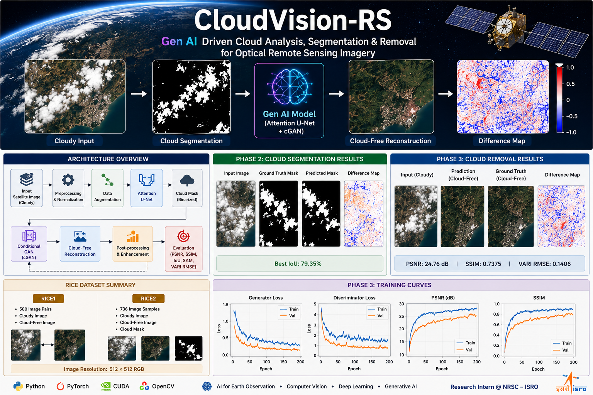
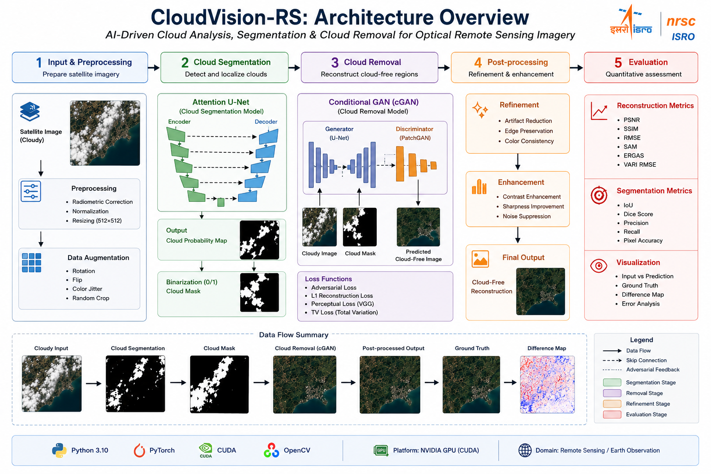
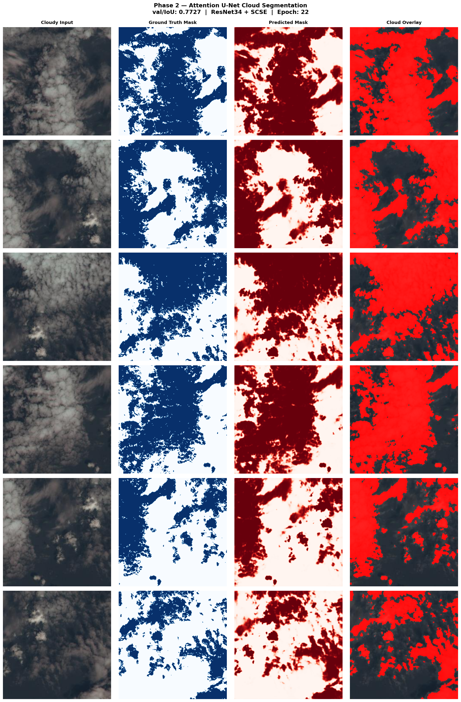
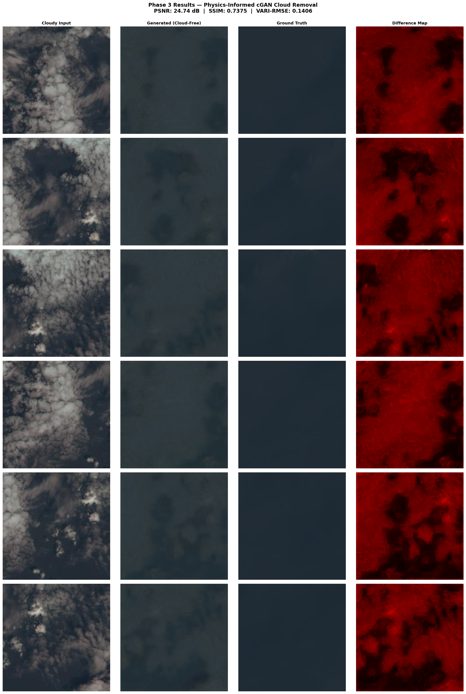
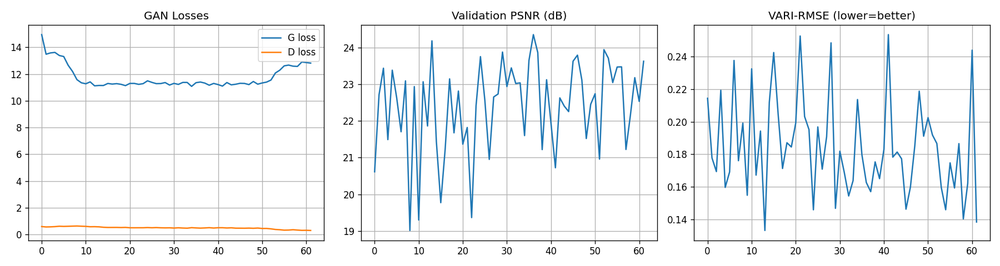

<div align="center">

# ☁️ CloudVision-RS

### AI-Driven Cloud Analysis, Segmentation & Cloud Removal for Optical Remote Sensing Imagery

**Deep Learning • Computer Vision • Generative AI • Remote Sensing • Earth Observation**

<p align="center">
  
</p>

[]()
[]()
[]()
[]()
[]()
[]()

**AI/ML Research Project developed during internship at the National Remote Sensing Centre (NRSC), Indian Space Research Organisation (ISRO).**

</div>

---

> **CloudVision-RS** is an AI-driven research framework for **cloud segmentation, cloud removal, and cloud-free satellite image reconstruction** from optical remote sensing imagery. The project combines modern deep learning techniques with scientifically meaningful evaluation metrics to recover cloud-obscured regions while preserving structural, spatial, and radiometric consistency for Earth Observation applications.

---

# 📖 Table of Contents

- Project Overview
- Key Features
- Research Motivation
- Current Experimental Results
- Research Progress
- Methodology
- Dataset
- Experimental Results
- Repository Structure
- Installation
- Usage
- Roadmap
- Future Work
- Citation
- Acknowledgements

---

# 🌍 Project Overview

Cloud contamination remains one of the major challenges in optical remote sensing. Clouds obscure valuable surface information, reducing the usability of satellite imagery for downstream applications such as agriculture, disaster monitoring, environmental analysis, and land-cover mapping.

CloudVision-RS aims to develop an end-to-end AI framework capable of:

- ☁️ Detecting cloud-covered regions
- 🎯 Performing accurate cloud segmentation
- 🛰️ Reconstructing cloud-free satellite imagery
- 📊 Preserving structural, spatial, and radiometric information
- 📈 Evaluating reconstruction quality using standard remote sensing metrics

The long-term objective is to build a scientifically reliable cloud-removal pipeline suitable for Earth Observation research and practical remote sensing applications.

---

# ✨ Key Features

## Cloud Segmentation

- Attention U-Net based semantic segmentation
- Binary cloud mask generation
- Data augmentation pipeline
- IoU and Dice Score evaluation
- Training visualization and validation

---

## Cloud Removal

- Conditional GAN (cGAN) based cloud reconstruction
- Cloud-free image generation
- Quantitative reconstruction evaluation
- Difference map visualization
- Multi-stage prediction pipeline

---

## Scientific Evaluation

The framework evaluates both segmentation and reconstruction quality using standard remote sensing metrics including:

- IoU
- Dice Score
- PSNR
- SSIM
- RMSE
- SAM
- ERGAS
- VARI RMSE

---

## Technology Stack

| Category | Technologies |
|-----------|--------------|
| Programming | Python |
| Deep Learning | PyTorch |
| Computer Vision | OpenCV |
| Scientific Computing | NumPy, SciPy |
| Data Processing | Pandas |
| Visualization | Matplotlib |
| GPU Computing | CUDA |
| Version Control | Git & GitHub |

---

# 🚀 Current Experimental Results

The repository currently contains implementations for both cloud segmentation and cloud removal.

| Task | Model | Current Best Result |
|------|-------|--------------------|
| Cloud Segmentation | Attention U-Net | **IoU = 79.35%** |
| Cloud Removal | Conditional GAN | **PSNR = 24.76 dB** |
| Structural Similarity | Conditional GAN | **SSIM = 0.7375** |
| Vegetation Index Error | Conditional GAN | **VARI RMSE = 0.1406** |

These results establish the current baseline for the ongoing research and provide a foundation for further optimization and model enhancement.

---

# 📈 Research Progress

| Module | Status |
|---------|--------|
| Environment Setup | ✅ Completed |
| Dataset Preparation | ✅ Completed |
| Project Structure | ✅ Completed |
| Data Augmentation | ✅ Completed |
| Attention U-Net | ✅ Completed |
| Cloud Segmentation | ✅ Completed |
| Conditional GAN Cloud Removal | ✅ Completed |
| Performance Evaluation | ✅ Completed |
| Model Optimization | 🔄 In Progress |
| Physics-Informed Enhancement | 🔄 In Progress |
| Research Publication Preparation | 🔄 In Progress |

---

# 🎯 Research Motivation

Clouds significantly reduce the availability of usable optical satellite imagery. Traditional cloud removal techniques often struggle to preserve spectral fidelity and structural consistency, limiting their applicability for scientific analysis.

This project investigates modern AI-based approaches for cloud segmentation and image reconstruction with the objective of producing cloud-free satellite imagery that is not only visually convincing but also quantitatively reliable for Earth Observation tasks.

The research focuses on improving reconstruction quality while maintaining consistency across multiple evaluation metrics, making the generated imagery more suitable for downstream remote sensing applications.

---

---

# 🏗️ Methodology

CloudVision-RS follows a modular, end-to-end deep learning framework for cloud segmentation and cloud removal from optical remote sensing imagery. The proposed pipeline consists of two primary stages: **cloud segmentation** using an optimized **Attention U-Net** and **cloud-free image reconstruction** using a **Conditional Generative Adversarial Network (cGAN)**.

The framework is designed to be modular, allowing independent optimization of each stage while providing flexibility for integrating physics-informed constraints, advanced generative models, and improved reconstruction strategies in future research.

<p align="center">
  
</p>

<p align="center">
  <em><b>Figure 1.</b> Overall architecture of the proposed CloudVision-RS framework.</em>
</p>

## Workflow

### 1. Input Satellite Image
- Load cloudy optical remote sensing imagery.

### 2. Data Preprocessing
- Image normalization
- Image resizing
- Dataset preparation

### 3. Data Augmentation
- Random Rotation
- Horizontal & Vertical Flip
- Random Crop
- Color Augmentation

### 4. Cloud Segmentation
- Attention U-Net predicts the cloud probability map.
- The probability map is converted into a binary cloud mask.

### 5. Cloud Removal
- The cloudy image together with the predicted cloud mask is provided to the Conditional GAN.
- The generator reconstructs the cloud-covered regions to produce a cloud-free satellite image.

### 6. Post-processing
- Image refinement
- Artifact reduction
- Contrast enhancement

### 7. Performance Evaluation

**Segmentation Metrics**

- IoU
- Dice Score
- Precision
- Recall
- Pixel Accuracy

**Reconstruction Metrics**

- PSNR
- SSIM
- RMSE
- SAM
- ERGAS
- VARI RMSE

The modular architecture enables independent optimization of the cloud segmentation and cloud removal stages while facilitating the integration of physics-informed loss functions, improved reconstruction strategies, and future extensions toward transformer-based and diffusion-based generative models.

---

# 🛰️ Dataset

## Remote Sensing Image Cloud Removing Dataset (RICE)

The proposed framework is trained and evaluated on the **Remote Sensing Image Cloud Removing Dataset (RICE)**, one of the most widely used benchmark datasets for supervised cloud removal research.

### Dataset Characteristics

| Property | Value |
|-----------|-------|
| Dataset | RICE |
| Learning Type | Supervised |
| Image Resolution | 512 × 512 |
| Channels | RGB |
| Task | Cloud Segmentation & Cloud Removal |

---

### RICE1

| Property | Value |
|----------|-------|
| Image Pairs | 500 |
| Cloudy Images | ✅ |
| Cloud-Free Images | ✅ |

---

### RICE2

| Property | Value |
|----------|-------|
| Samples | 736 |
| Cloudy Images | ✅ |
| Cloud-Free Images | ✅ |
| Cloud Masks | ✅ |

The paired cloudy and cloud-free satellite images enable supervised training for both cloud segmentation and cloud-free image reconstruction tasks.

---

# 🎯 Cloud Segmentation Results

The cloud segmentation stage is implemented using an optimized **Attention U-Net** architecture trained on augmented remote sensing imagery.

<p align="center">
  
</p>

<p align="center">
  <em><b>Figure 2.</b> Qualitative cloud segmentation results generated using the Attention U-Net model.</em>
</p>

## Key Improvements

- IoU improved from **77.00%** to **79.35%**
- Improved localization of cloud boundaries
- Reduced false-positive predictions
- Better segmentation consistency across validation samples
- More accurate cloud mask generation through optimized preprocessing and data augmentation

The improved segmentation performance demonstrates the effectiveness of the proposed preprocessing pipeline together with the Attention U-Net architecture for accurate cloud localization.

---

# 🌤️ Cloud Removal & Reconstruction Results

The cloud removal stage employs a **Conditional Generative Adversarial Network (cGAN)** to reconstruct cloud-free optical satellite imagery from cloudy observations.

<p align="center">
  
</p>

<p align="center">
  <em><b>Figure 3.</b> Qualitative cloud removal and cloud-free image reconstruction results using the proposed Conditional GAN.</em>
</p>

The qualitative comparison illustrates:

- Cloudy Input Image
- Generated Cloud-Free Prediction
- Ground Truth Image
- Reconstruction Difference Map

The reconstruction results demonstrate the capability of the proposed model to recover cloud-obscured regions while preserving important structural information present in the original satellite imagery.

---

# 📉 Training Curves

The learning curves illustrate the optimization behavior of the proposed model throughout training. They provide insight into convergence stability, generalization capability, and the effectiveness of the optimization strategy.

<p align="center">
  
</p>

<p align="center">
  <em><b>Figure 4.</b> Training and validation curves illustrating the convergence behavior of the proposed model.</em>
</p>

The plots demonstrate:

- Stable model convergence
- Effective optimization
- Improved learning dynamics
- Generalization capability
- Reduced overfitting

---

# 📏 Evaluation Metrics

The proposed framework is evaluated using standard computer vision and remote sensing metrics to assess both segmentation accuracy and cloud-free image reconstruction quality.

## Segmentation Metrics

| Metric | Description |
|----------|-------------|
| IoU | Overlap between predicted and ground-truth cloud masks |
| Dice Score | Segmentation similarity |
| Precision | False-positive analysis |
| Recall | False-negative analysis |
| Pixel Accuracy | Overall segmentation accuracy |

---

## Reconstruction Metrics

| Metric | Description |
|----------|-------------|
| PSNR | Peak Signal-to-Noise Ratio |
| SSIM | Structural Similarity Index |
| RMSE | Root Mean Square Error |
| SAM | Spectral Angle Mapper |
| ERGAS | Relative Global Dimensional Error |
| VARI RMSE | Vegetation Index Reconstruction Error |

---

# 🏆 Experimental Results Summary

| Component | Model | Best Result |
|-----------|-------|------------:|
| Cloud Segmentation | Attention U-Net | **IoU = 79.35%** |
| Cloud Removal | Conditional GAN | **PSNR = 24.76 dB** |
| Structural Similarity | Conditional GAN | **SSIM = 0.7375** |
| Vegetation Preservation | Conditional GAN | **VARI RMSE = 0.1406** |

The current implementation demonstrates the effectiveness of combining an optimized Attention U-Net for cloud segmentation with a Conditional GAN for cloud-free image reconstruction. Ongoing research focuses on improving reconstruction fidelity, preserving spectral characteristics, and integrating physics-informed optimization strategies to further enhance both quantitative and qualitative performance.

---

# ⚙️ Installation

## Clone the Repository

```bash
git clone https://github.com/<your-username>/CloudVision-RS.git
cd CloudVision-RS
```

---

## Create a Virtual Environment (Recommended)

### Using Conda

```bash
conda create -n cloudvision python=3.10
conda activate cloudvision
```

### Using venv

```bash
python -m venv venv
```

Activate the environment:

**Windows**

```bash
venv\Scripts\activate
```

**Linux / macOS**

```bash
source venv/bin/activate
```

---

## Install Dependencies

```bash
pip install -r requirements.txt
```

---

## Verify GPU (Optional)

```python
import torch

print(torch.cuda.is_available())
print(torch.cuda.get_device_name(0))
```

---

# 🚀 Usage

## Train Cloud Segmentation Model

```bash
python train_segmentation.py
```

---

## Evaluate Segmentation

```bash
python evaluate_segmentation.py
```

---

## Train Cloud Removal Model

```bash
python train_cloud_removal.py
```

---

## Generate Cloud-Free Images

```bash
python predict.py
```

---

## Visualize Results

```bash
python show_results.py
```

---

# 📁 Repository Structure

```text
CloudVision-RS/
│
├── assets/
│   ├── banner.png
│   ├── architecture.png
│   ├── phase2_results.png
│   ├── phase3_results.png
│   └── training_curves.png
│
├── dataset/
│
├── docs/
│   └── Cloud_Removal_Technical_Report.md
│
├── models/
│
├── notebooks/
│
├── outputs/
│
├── src/
│   ├── data/
│   │   ├── augmentation.py
│   │   ├── preprocessing.py
│   │   └── dataset.py
│   │
│   ├── segmentation/
│   │   ├── attention_unet.py
│   │   ├── train.py
│   │   └── evaluate.py
│   │
│   ├── cloud_removal/
│   │   ├── generator.py
│   │   ├── discriminator.py
│   │   ├── losses.py
│   │   └── train.py
│   │
│   └── utils/
│
├── tests/
│
├── requirements.txt
├── README.md
└── LICENSE
```

---

# 🛣️ Development Roadmap

| Phase | Status |
|--------|--------|
| Literature Review | ✅ Completed |
| Environment Setup | ✅ Completed |
| Dataset Preparation | ✅ Completed |
| Data Augmentation | ✅ Completed |
| Attention U-Net Implementation | ✅ Completed |
| Cloud Segmentation | ✅ Completed |
| Conditional GAN Cloud Removal | ✅ Completed |
| Model Evaluation | ✅ Completed |
| Hyperparameter Optimization | 🔄 In Progress |
| Physics-Informed Optimization | 🔄 In Progress |
| Experimental Benchmarking | 🔄 In Progress |
| IEEE Paper Preparation | 🔄 In Progress |

---

# 📅 Research Timeline

| Stage | Progress |
|---------|----------|
| Literature Survey | ✅ |
| Baseline Implementation | ✅ |
| Segmentation Optimization | ✅ |
| Cloud Removal Framework | ✅ |
| Experimental Evaluation | ✅ |
| Model Optimization | 🔄 |
| Documentation | 🔄 |
| Publication Preparation | 🔄 |

---

# 💻 Technology Stack

## Programming Languages

- Python

---

## Deep Learning Frameworks

- PyTorch

---

## Computer Vision

- OpenCV

---

## Scientific Computing

- NumPy
- SciPy
- Pandas

---

## Visualization

- Matplotlib

---

## Development Tools

- Git
- GitHub
- VS Code
- Jupyter Notebook

---

## Hardware

- NVIDIA RTX GPU (CUDA Acceleration)

---

# 📊 Current Project Status

| Component | Progress |
|-----------|----------|
| Dataset | ✅ Ready |
| Segmentation Model | ✅ Stable |
| Cloud Removal Model | ✅ Stable |
| Experimental Evaluation | ✅ Complete |
| Documentation | 🔄 Improving |
| Research Publication | 🔄 Ongoing |

---

# 🌟 Highlights

- End-to-end cloud analysis and cloud removal framework.
- Attention U-Net based cloud segmentation.
- Conditional GAN based cloud-free image reconstruction.
- Quantitative evaluation using remote sensing metrics.
- Modular PyTorch implementation.
- GPU accelerated training.
- Research conducted during AI/ML Internship at **NRSC–ISRO**.
- Designed for Earth Observation and agricultural remote sensing applications.

---
---

# 🔮 Future Work

CloudVision-RS is an actively evolving research project. Future development will focus on improving both the scientific reliability and reconstruction quality of cloud-free satellite imagery.

## Research Directions

- Integrate **Physics-Informed Loss Functions** for improved radiometric consistency.
- Enhance reconstruction fidelity using advanced optimization strategies.
- Extend support to **multispectral and Sentinel-2 imagery**.
- Investigate **Transformer-based architectures** for cloud segmentation.
- Explore **Diffusion Models** for high-fidelity cloud reconstruction.
- Improve preservation of spectral and vegetation information.
- Benchmark against additional public cloud-removal datasets.
- Develop a scalable framework suitable for large-scale Earth Observation applications.

---

# 📌 Project Status

> **Status:** 🟢 Active Research & Development

CloudVision-RS is actively maintained as part of an ongoing AI/ML research internship at the **National Remote Sensing Centre (NRSC), Indian Space Research Organisation (ISRO)**. The repository will continue to evolve with improved models, experimental results, documentation, and research contributions.

---

# 📚 Publications

This project forms part of an ongoing AI/ML research internship at the National Remote Sensing Centre (NRSC), ISRO.

The current implementation and experimental results are being continuously refined, with the long-term objective of preparing a research publication in the field of **Remote Sensing**, **Computer Vision**, and **Generative AI**.

---

# 🤝 Contributing

Contributions that improve the project are always welcome.

If you would like to contribute:

1. Fork the repository
2. Create a new feature branch
3. Commit your changes
4. Push your branch
5. Open a Pull Request

For major changes, please open an issue first to discuss the proposed improvements.

---

# 📜 Citation

If you use this repository in your research or project, please consider citing it.

```bibtex
@misc{cloudvisionrs2026,
  title        = {CloudVision-RS: Generative AI-Driven Cloud Analysis, Segmentation and Cloud Removal for Optical Remote Sensing Imagery},
  author       = {Vishwas Choudhary},
  year         = {2026},
  howpublished = {\url{https://github.com/Vishwasgithu/CloudVision-RS}},
  note         = {Research Project}
}
```

---

# 🙏 Acknowledgements

This work was carried out during an AI/ML Research Internship at the **National Remote Sensing Centre (NRSC), Indian Space Research Organisation (ISRO)**.

The author would like to acknowledge:

- National Remote Sensing Centre (NRSC)
- Indian Space Research Organisation (ISRO)
- The creators of the RICE dataset
- The open-source machine learning community
- The developers and contributors of PyTorch, OpenCV, NumPy, and related scientific computing libraries

> **Disclaimer:** This repository represents the author's research and implementation work carried out during the internship. The content and code in this repository should not be interpreted as official software, products, or endorsed research outputs of NRSC or ISRO.

---

# 📄 License

This project is released under the **MIT License**.

See the `LICENSE` file for more details.

---

# 👨‍💻 Author

## Vishwas Choudhary

**B.Tech – Artificial Intelligence & Data Science**

AI/ML Research Intern – **National Remote Sensing Centre (NRSC), ISRO**

### Connect with Me

- GitHub: https://github.com/Vishwasgithu
- LinkedIn: *(Add your LinkedIn profile URL)*
- Email: *(Add your professional email address)*

---

# ⭐ Support the Project

If you found this repository useful or interesting, please consider giving it a ⭐ on GitHub.

Your support helps improve the project and encourages continued research and development.

---

<div align="center">

## 🌍 CloudVision-RS

### Generative AI-Driven Cloud Analysis, Segmentation & Cloud Removal for Optical Remote Sensing Imagery

**Developed with ❤️ for AI, Earth Observation, and Remote Sensing Research**

</div>
